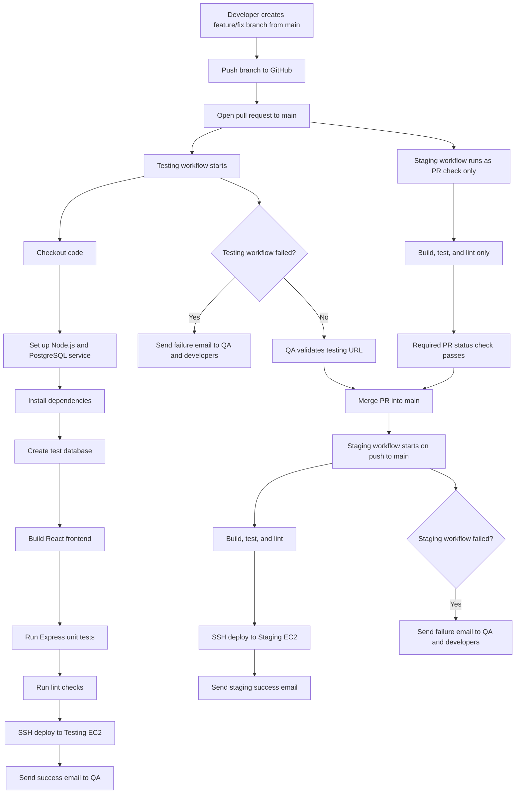

# AI Model Registry

AI Model Registry is a multi-service DevOps assignment project built with a React frontend, an Express/Node.js backend, and PostgreSQL. The application lets a team register AI models, view deployment status, track accuracy, and confirm that frontend, backend, and database services are connected end to end.

The main assignment goal is to demonstrate a CI/CD pipeline using GitHub Actions, GitHub branch protection, AWS EC2 testing and staging environments, automated quality checks, SSH deployment, and email notifications.

## Repository

- GitHub repository: https://github.com/Zain-ul-abdeen-773/Assignment_4-DevOps
- Default branch: `main`
- Visibility: public
- Protected branch: `main`
- Validation PR: https://github.com/Zain-ul-abdeen-773/Assignment_4-DevOps/pull/1

## Application Stack

| Layer | Technology | Purpose |
| --- | --- | --- |
| Frontend | React, Vite, Tailwind CSS, Recharts, Framer Motion | Model registry dashboard and form UI |
| Backend | Node.js, Express | REST API for health checks and model registry operations |
| Database | PostgreSQL | Persistent model records |
| Process manager | PM2 | Keeps the backend running on EC2 |
| Reverse proxy | Nginx | Serves the React build and proxies `/api` to Express |
| CI/CD | GitHub Actions | Build, test, lint, deploy, and notify |
| Cloud | AWS EC2 Ubuntu Server 24 LTS target | Testing and staging environments |

## Features

- Dashboard cards for total models, average accuracy, and active deployments.
- Registry table populated from PostgreSQL through the Express API.
- Model creation form with backend validation.
- Health endpoint at `/api/health`.
- Seed data for demo and first deployment.
- Automated schema initialization during deployment.
- CI/CD workflows for testing and staging environments.

## Environment URLs

| Environment | URL | API Health |
| --- | --- | --- |
| Testing | http://44.197.47.89 | http://44.197.47.89/api/health |
| Staging | http://54.208.194.141 | http://54.208.194.141/api/health |

Both health endpoints were checked and returned `{"status":"ok"}`.

## Local Setup

### Prerequisites

- Node.js 18+
- PostgreSQL 14+
- `psql` available on `PATH`

### Install Dependencies

```bash
npm install
```

### Configure Environment

Copy the example file and update database credentials if needed:

```bash
cp server/.env.example server/.env
```

Required server variables:

```text
PGHOST=localhost
PGUSER=postgres
PGPASSWORD=postgres
PGDATABASE=ai_model_registry
PGPORT=5432
CLIENT_ORIGIN=http://localhost:5173
```

### Create Databases

```bash
psql -U postgres -c "CREATE DATABASE ai_model_registry;"
psql -U postgres -c "CREATE DATABASE ai_model_registry_test;"
```

### Initialize and Seed

```bash
npm --prefix server run db:init
npm --prefix server run db:seed
```

### Run the Full Stack

```bash
npm run dev
```

- Frontend: http://localhost:5173
- Backend: http://localhost:5000
- Health check: http://localhost:5000/api/health

## Quality Commands

```bash
npm --prefix server run test
npm run lint
npm run build
```

The server unit tests cover:

- `GET /api/models`
- `POST /api/models`
- required-field validation for model creation

## CI/CD Workflows

The repository contains two GitHub Actions workflows.

| Workflow | Trigger | Target | Purpose |
| --- | --- | --- | --- |
| `testing.yml` | Pull request to `main`, manual dispatch | Testing EC2 | Build, unit test, lint, deploy PR branch, email QA/devs |
| `staging.yml` | Push to `main`, manual dispatch | Staging EC2 | Build, unit test, lint, deploy main branch, email QA/devs |

The staging workflow also runs as a PR status check, but it skips the actual staging deploy and email steps during pull requests. This lets `main` branch protection require both workflow checks before merge without deploying to staging before QA approval.

## CI/CD Flow Diagram



## Deployment Design

Each EC2 instance is prepared with:

- Git
- Node.js 18
- Nginx
- PostgreSQL
- PM2

The workflow deploys through SSH using `appleboy/ssh-action`. On the server, `deploy/remote_deploy.sh`:

- clones or updates the repository under `/opt/ai-model-registry`
- writes the server `.env` from the base64 GitHub secret
- initializes the database schema
- optionally seeds the database
- builds the React frontend with `VITE_API_URL=/api`
- installs/updates the Nginx site config
- restarts the Express API through PM2

## GitHub Actions Configuration

Repository secrets configured:

- `SSH_USER`
- `SSH_KEY`
- `SSH_PORT`
- `TESTING_HOST`
- `STAGING_HOST`
- `SERVER_ENV_B64_TESTING`
- `SERVER_ENV_B64_STAGING`
- `SMTP_HOST`
- `SMTP_PORT`
- `SMTP_USER`
- `SMTP_PASS`
- `SMTP_FROM`
- `QA_EMAIL`
- `DEV_EMAILS`

Repository variables configured:

- `TESTING_URL`
- `STAGING_URL`
- `TESTING_API_URL`
- `STAGING_API_URL`
- `SEED_ON_DEPLOY`

The helper script [scripts/configure-github-actions.ps1](scripts/configure-github-actions.ps1) can reapply these settings from GitHub CLI.

## Branch Protection

The `main` branch is protected so collaborators cannot bypass the pull request flow. The rule requires:

- pull requests before merging
- `Deploy to Testing / build-test-lint-deploy`
- `Deploy to Staging / build-test-lint-deploy`
- no force pushes
- no branch deletion

## Assignment Compliance Summary

| Requirement | Status |
| --- | --- |
| Multi-service app with frontend, backend, and database | Done |
| Public GitHub repository | Done |
| Local development instructions | Done |
| Testing EC2 deployment workflow | Done |
| Staging EC2 deployment workflow | Done |
| Manual workflow triggers | Done |
| Build step in workflows | Done |
| Unit test step in workflows | Done |
| Lint step in workflows | Done |
| Email notification setup | Done with Mailtrap demo recipient |
| Main branch protection | Done |
| Collaborator invites | Still needs confirmation/invites |
| Screenshots for final report | Still needs capture |
| Final merge to `main` and staging push validation | Still pending because PR #1 is open |

## Challenges Faced

- GitHub CLI initially had an invalid stored token, so repo configuration could not be applied until the stale login was removed and authentication was repeated.
- `actions/setup-node` caching failed because the repository did not have a package lockfile. The workflows were adjusted to avoid lockfile-dependent caching.
- Mailtrap rejected `giki.edu.pk` as a sender domain. The SMTP sender was changed to the Mailtrap demo sender.
- Mailtrap demo domains only send to the account owner, so `QA_EMAIL` is currently set to the Mailtrap-allowed recipient for validation. For final instructor delivery, replace it with the instructor email after using a verified sending domain or another SMTP provider.
- Branch protection and required checks had to be tuned so both testing and staging checks can run on pull requests without deploying to staging before merge.

## Screenshots to Capture for Report

The assignment report still needs screenshots with captions. Suggested screenshots:

- local app running at `localhost:5173`
- successful backend health check
- PostgreSQL database/table or seeded data
- GitHub repository visibility
- collaborator invitation page
- branch protection rule for `main`
- AWS testing EC2 instance
- AWS staging EC2 instance
- shared security group rules
- GitHub Actions secrets and variables names
- successful testing workflow run
- testing deployed URL
- successful staging workflow run after merge
- staging deployed URL
- email notification received in Mailtrap

## Additional Documentation

- EC2 setup and deployment: [docs/deployment.md](docs/deployment.md)
- GitHub Actions setup: [docs/ci-cd.md](docs/ci-cd.md)